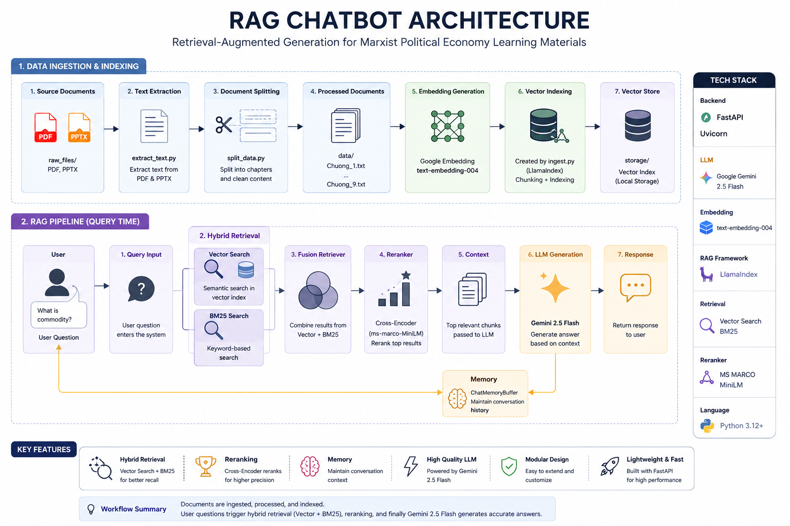

# RAG Chatbot for Marxist Political Economy

<p align="center">
  
  
  
  
</p>

A Retrieval-Augmented Generation (RAG) chatbot designed for answering questions from Marxist Political Economy learning materials.

The system integrates Google Gemini, LlamaIndex, Hybrid Retrieval (Vector Search + BM25), and Cross-Encoder Reranking to provide accurate and context-aware responses.

---
## Architecture

<p align="center">
  
</p>

## Features

* PDF and PPTX document ingestion
* Automatic text extraction
* Document chunking and indexing
* Google Embedding Model (text-embedding-004)
* Hybrid Retrieval (Vector Search + BM25)
* Cross-Encoder Reranking
* Conversational Memory
* Gemini 2.5 Flash Integration
* FastAPI Backend
* Lightweight Web Interface

---

## System Architecture

```text
Documents (PDF/PPTX)
        │
        ▼
 Text Extraction
        │
        ▼
 Document Splitting
        │
        ▼
 Embedding Generation
(text-embedding-004)
        │
        ▼
 Vector Index Storage
        │
        ▼
───────────────────────────
        │
User Question
        │
        ▼
 Hybrid Retrieval
(Vector + BM25)
        │
        ▼
 Cross-Encoder Reranker
        │
        ▼
 Gemini 2.5 Flash
        │
        ▼
 Generated Response
```

---

## Project Structure

```text
RAG/
│
├── raw_files/              # Original PDF/PPTX files
├── data/                   # Processed chapter files
├── static/                 # Frontend resources
│
├── extract_text.py         # Extract text from documents
├── split_data.py           # Split content into chapters
├── ingest.py              # Build vector index
├── backend_rag.py         # FastAPI backend
│
├── requirements.txt
├── README.md
└── .env.example
```

---

## Technologies

| Category        | Technology           |
| --------------- | -------------------- |
| Language        | Python               |
| Framework       | FastAPI              |
| LLM             | Gemini 2.5 Flash     |
| RAG Framework   | LlamaIndex           |
| Embedding Model | text-embedding-004   |
| Retrieval       | Vector Search + BM25 |
| Reranking       | MS MARCO MiniLM      |
| Frontend        | HTML, CSS            |

---

## Installation

Clone repository:

```bash
git clone https://github.com/your-username/rag-chatbot.git
cd rag-chatbot
```

Install dependencies:

```bash
pip install -r requirements.txt
```

Create environment file:

```env
GOOGLE_API_KEY=YOUR_API_KEY
```

---

## Build Knowledge Base

Extract text from source documents:

```bash
python extract_text.py
```

Split documents into chapters:

```bash
python split_data.py
```

Generate embeddings and create vector index:

```bash
python ingest.py
```

---

## Run Application

```bash
uvicorn backend_rag:app --reload
```

Open:

```text
http://127.0.0.1:8000
```

---

## Retrieval Pipeline

1. User submits a question
2. Query Fusion Retriever is triggered
3. Vector Search retrieves semantic matches
4. BM25 retrieves keyword matches
5. Results are merged
6. Cross-Encoder reranks documents
7. Gemini generates final answer
8. Chat memory stores conversation context

---

## Future Improvements

* ChromaDB / Qdrant Integration
* Semantic Chunking
* Citation Support
* Query Rewriting
* Multi-document Collections
* User Authentication
* Docker Deployment

---

## Author

Developed as an educational Retrieval-Augmented Generation project using Google Gemini and LlamaIndex.

